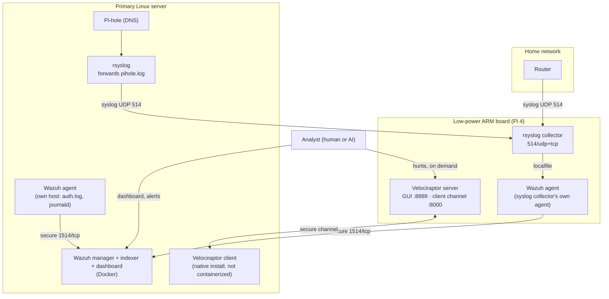

# SIEM + DFIR Integration: Wazuh and Velociraptor Working Together

## Overview
Two separate tools now cover this network's security monitoring, and they're deliberately not the same kind of tool. Wazuh (SIEM/HIDS — [doc 01](01-ssh-hardening-and-incident-response.md)'s cryptominer investigation was the informal start of this instinct) watches continuously and alerts the moment something matches a known-bad pattern. [Velociraptor](15-dfir-hunting-with-velociraptor.md) (DFIR/threat hunting) does nothing on its own — it answers a specific question against a specific endpoint the moment someone asks. This doc covers how the two are wired together, what each one actually catches that the other doesn't, and a real worked example: a genuine alert, fired for real, chased down with a real hunt, with an honest bug found along the way.

## Architecture



Two things worth calling out about this shape:
- **Third-party devices (the router, Pi-hole) can't run an agent, so they never talk to Wazuh directly** — everything from them funnels through the syslog collector, which itself runs a Wazuh agent to relay it onward. The collector is a translation layer, not just a relay.
- **The primary server carries two independent agents for two different jobs** — a Wazuh agent watching its own logs continuously, and a Velociraptor client that only acts when asked. Neither depends on the other; either could be removed without breaking the other.

## Division of labor: what each one actually catches

| | Wazuh (SIEM/HIDS) | Velociraptor (DFIR) |
|---|---|---|
| **Mode** | Continuous, passive, alerts on match | On-demand, active, answers one question at a time |
| **Best at** | "Something just happened that matches a known-bad pattern" — auth failures, log-based rule matches, file integrity changes, compliance mapping out of the box (PCI-DSS, HIPAA, GDPR, NIST, MITRE ATT&CK tagging built into the default ruleset) | "Show me the current real state of this specific machine" — process trees, every SUID binary, every cron entry with file hashes, raw file access, timeline reconstruction |
| **Blind spot** | Only sees what a decoder + rule was written for. Traffic with no matching rule is genuinely invisible — this is exactly what happened with the Pi-hole/router syslog feed before a custom rule existed for it (see [doc 15](15-dfir-hunting-with-velociraptor.md)) | Doesn't watch anything by default. If nobody asks a question, nothing gets checked — it has zero opinion about what's normal until pointed at something |
| **Analogy** | The tripwire | The flashlight |

Neither replaces the other. A SIEM with no hunting capability behind it means every alert is a dead end — you know something happened but can't dig further without logging into the box by hand. A hunting tool with no SIEM in front of it means nothing ever tells you *when* to go look. Together, the SIEM decides when to point the flashlight.

## Worked example: a real alert, chased down with a real hunt

### 1. Trigger
Four failed SSH connection attempts were made against the primary server from the workstation, using a nonexistent username, specifically to generate a genuine authentication-failure event rather than describe one hypothetically.

### 2. The Wazuh alert
Fired immediately, no manual review needed to notice it — pulled straight from the live alert index:

```
Rule ID: 5710, Level 5
Description: sshd: Attempt to login using a non-existent user
Agent: knightfall (the primary server's own host agent)
Source IP: <workstation's LAN address>
Attempted user: <the nonexistent username used>
MITRE ATT&CK: T1110.001 (Password Guessing), T1021.004 (SSH) — tactics: Credential Access, Lateral Movement
Compliance tags: PCI-DSS 10.2.4/10.2.5/10.6.1, HIPAA 164.312.b, GDPR IV_35.7.d/IV_32.2, NIST 800-53 AU.14/AC.7/AU.6
firedtimes: 5
```

The MITRE and compliance mapping came free from Wazuh's default ruleset — nothing custom was written to get that context on a plain SSH auth failure.

### 3. First hunt attempt — and a real bug found
The obvious next move: run Velociraptor's built-in `Linux.Syslog.SSHLogin` artifact against the same host to corroborate from a second data path. It returned **zero rows**.

Rather than assume the hunt was misconfigured, checked the artifact's actual source. It parses the raw auth log with a Grok expression that expects classic BSD syslog timestamps (`Mon DD HH:MM:SS`). This server's `rsyslog` writes ISO 8601 timestamps to `/var/log/auth.log` by default — a genuinely different, also-standard format the shipped artifact's regex was never written to handle. The artifact fails **silently**: no error, just an empty result set, which is worse than an obvious failure because it looks like "nothing to find" instead of "the tool couldn't read the file." Worth knowing before trusting this specific artifact on any modern Debian/Ubuntu box with default logging.

### 4. Second hunt — successful corroboration
Ran a direct query against the same file instead of the timestamp-dependent artifact, searching for the exact attempted username rather than trying to parse the whole line's structure. This returned all twelve matching raw log lines — three per connection attempt across all four attempts — independently confirming, from a completely separate code path than the one that generated the Wazuh alert, that the event was real: an invalid-user attempt, a failed authentication, and a closed connection, once per attempt, with the exact source port of every individual attempt (detail the single deduplicated Wazuh alert doesn't surface as cleanly across repeated attempts from the same source).

### What this actually demonstrates
Two tools, reading the same underlying event through two independent mechanisms — a structured decoder-and-rule match versus a raw pattern search — landed on the same ground truth. That agreement is the point: a SOC analyst (or an AI operating one) shouldn't trust a single tool's read of an event when a second, independently-implemented check is cheap to run. And the process surfaced a real, previously-unknown limitation in a piece of shipped tooling along the way — exactly the kind of thing that only turns up when you actually run the tool against real data instead of trusting the documentation.

## Verification
- The Wazuh alert was pulled from the live alert index by its actual rule ID and MITRE tags, not paraphrased from a dashboard screenshot.
- Both Velociraptor hunts were run against the real enrolled client over the real secure channel — the failed one's zero-row result was investigated to a specific root cause rather than dismissed, and the working one's twelve rows were checked line-by-line against the original trigger.
- The whole chain — trigger event, alert, failed hunt, root-caused bug, successful corroborating hunt — happened in one continuous session against the actual running lab, not reconstructed after the fact.
